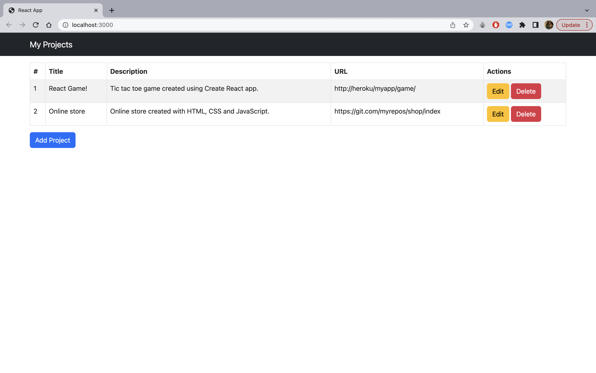
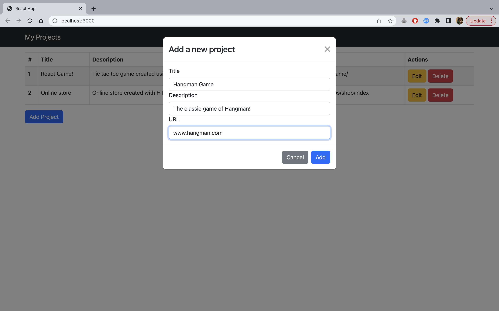
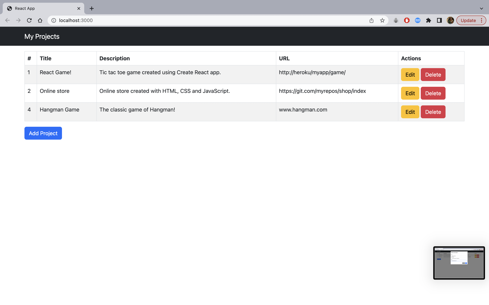
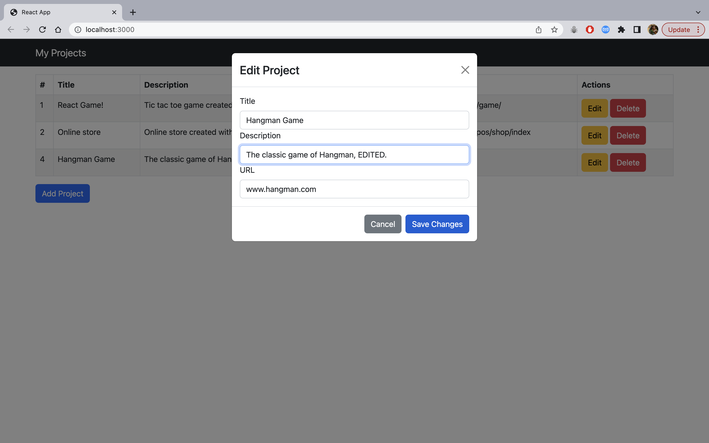
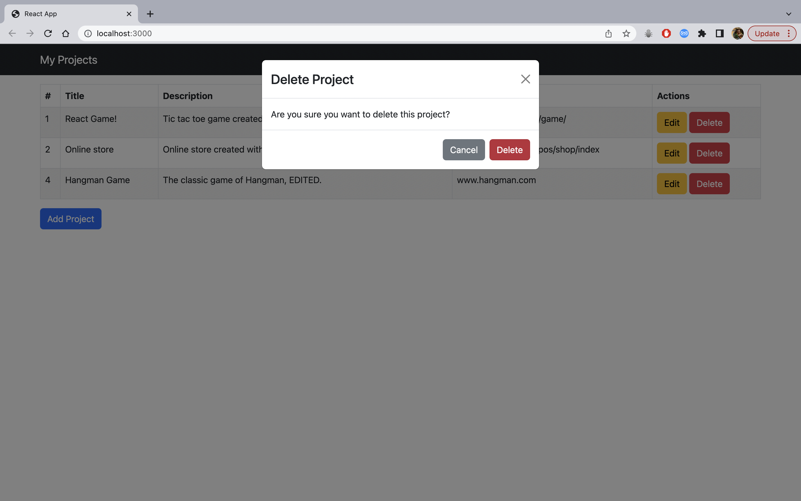

# Project Management App

## Description

This project is a web application built using React, React Bootstrap and Express. It fetches data from APIs hosted on a server, and allows the user to add new projects, as well as edit or delete previous projects.

## Table of Contents

1. Screenshots
2. Getting Started
3. Installation
4. Credits

## Screenshots

## Getting Started

To run the app locally, follow these steps:

### Prerequisites

- Node.js (v14 or higher)
- React (v18 or higher)
- Express
- Nodemon
- Axios

### Installation

1. Clone the repository to your local machine using the command **git clone** https://github.com/silviucoler/Project-Management-App.git
2. Navigate to the project directory using the command **cd Project-Management-App**
3. Install the necessary dependencies using the command **npm install**
4. Start the local server using the command **npm start** in the backend folder.
5. Start the app by typing **npm start** in the frontend server.

### Usage

Following the steps above should start the app in your preferred web browser. However, if it fails to do so, the app will be running at **http://localhost:3000**

## Credits

This personal site was developed by me as a solo project for HyperionDev bootcamp. However, if you would like to contribute to the project or suggest any changes, feel free to create a pull request.
